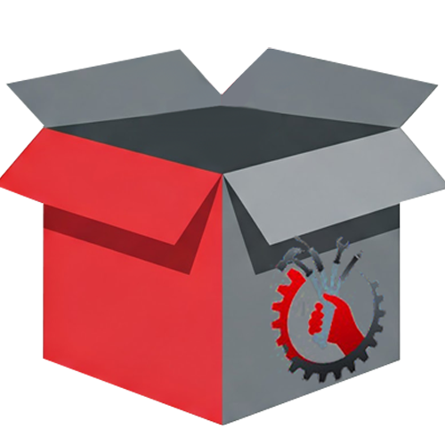

# TecnoDeposit

<div align="center">
  
  
  <h3>Il tuo magazzino digitale</h3>
  <a href="https://app.tecnodeposit.it">
    
  </a>
  <br><br> <p align="center">
    <a href="https://app.tecnodeposit.it">Live Demo</a> •
    <a href="#-funzionalità-principali">Descrizione</a> •
    <a href="#-requisiti">Requisiti</a> •
    <a href="#-setup-e-configurazione">Setup</a> •
    <a href="#-struttura-progetto">Struttura</a> •
    <a href="#-contribuire">Contribuire</a> 
  </p>
</div>


---

## 👤 Autore

<a href="https://github.com/KekkoCoppola">
  
  <strong>Francesco Coppola</strong>
</a>

## 🚀 Funzionalità Principali

- **Gestione Inventario**: CRUD completo articoli con stati, assegnazioni tecnici, tracking garanzie
- **Richieste Materiale**: Sistema di richieste con workflow approvazione
- **Gestione Fornitori**: Anagrafica fornitori e centri revisione
- **Autenticazione**: Login sicuro con gestione ruoli (Admin/Tecnico)
- **Notifiche**: Sistema notifiche email con template HTML
- **Scanner QR/Barcode**: Ricerca rapida articoli tramite scanner
- **Statistiche**: Dashboard con report e contatori real-time
- **Import/Export**: Import bulk articoli, backup database

## 📋 Requisiti

- **Java JDK**: 17 o superiore
- **Application Server**: Apache Tomcat 10.1+ o compatibile Jakarta EE
- **Database**: MySQL 8.0+
- **Build Tool**: Maven o Ant (a seconda della configurazione)

## ⚙️ Setup e Configurazione

### NB. Codice Svuota Magazzino
Il codice otp per lo svuotamento del magazzino.
```
a3D!9fLk7@pQ4zV6m#Y1dR8wK$eJ0tN3cX7zT1wF5hR8uP2sL0vM9gB6dQ3yC4
```

### 1. Clone del Repository

```bash
git clone https://github.com/yourusername/TecnoDeposit.git
cd TecnoDeposit
```

### 2. Configurazione Database

Crea il database MySQL:

```sql
CREATE DATABASE tecnodeposit CHARACTER SET utf8mb4 COLLATE utf8mb4_unicode_ci;
CREATE USER 'tecnodeposit_user'@'localhost' IDENTIFIED BY 'your_secure_password';
GRANT ALL PRIVILEGES ON tecnodeposit.* TO 'tecnodeposit_user'@'localhost';
FLUSH PRIVILEGES;
```

Importa lo schema database:

```bash
mysql -u tecnodeposit_user -p tecnodeposit < src/main/resources/DB.sql
```

### 3. Configurazione Applicazione

1. Copia il file template di configurazione:

```bash
cp src/main/resources/config.properties.template src/main/resources/config.properties
```

2. Modifica `config.properties` con le tue credenziali:

```properties
# Database
db.url=jdbc:mysql://localhost:3306/tecnodeposit
db.username=tecnodeposit_user
db.password=your_secure_password

# Email SMTP (per invio notifiche)
email.smtp.host=smtp.gmail.com
email.smtp.port=587
email.smtp.username=your-email@gmail.com
email.smtp.password=your-app-password
email.smtp.from=noreply@tecnodeposit.it

# AES Key per crittografia (genera nuova chiave)
crypto.aes.key.b64=YOUR_BASE64_KEY_HERE
```

### 4. Generare Chiave AES

Per la crittografia dei dati sensibili, genera una chiave AES-256:

```bash
# Linux/Mac
openssl rand -base64 32

# Windows (PowerShell)
$bytes = New-Object byte[] 32; (New-Object System.Security.Cryptography.RNGCryptoServiceProvider).GetBytes($bytes); [Convert]::ToBase64String($bytes)
```

Copia il risultato in `crypto.aes.key.b64` nel file `config.properties`.

### 5. Build e Deploy

#### Con Maven:

```bash
mvn clean package
cp target/TecnoDeposit.war /path/to/tomcat/webapps/
```

#### Con IDE (Eclipse):

1. File > New Project > Dynamic Web Projecy
2. Configura il web project come segue
3. 
4. Copia Tutto il contenuto della repository nella nuova cartella che hai creato e seleziona "Sostituisci i 2 file"
4. Inserisci queste 4 librerie nella cartella src>main>webapp>lib
5. 
6. Configura Tomcat nella sezione Server > New Server > apache > Tomcat v10.1 > Download And Install > Finish
7. Aggiungi il progetto a tomcat cliccando con tasto destro su tomcat v10.1 > Add & Remove > seleziona "TecnoDeposit" > Add > Finish
8. Ora avvia Tomcat e raggiungi tramite web l'indirizzo http:localhost:8080/TecnoDeposit


## 🔐 Configurazione Email (Gmail)

Se usi Gmail per SMTP:

1. Vai su [Google Account Security](https://myaccount.google.com/security)
2. Abilita "2-Step Verification"
3. Genera "App Password" per TecnoDeposit
4. Usa l'App Password nel file `config.properties`

## 🛡️ Sicurezza

> **⚠️ IMPORTANTE**: Non committare mai il file `config.properties` nel repository!

Il file `.gitignore` è configurato per escludere:
- `config.properties` (credenziali)
- File di build (`*.class`, `*.war`)
- File IDE (`.idea`, `.settings`)
- Log files

### Best Practices

- Cambia tutte le password di default
- Usa password forti per database e admin
- Configura HTTPS in produzione
- Limita accesso database solo da localhost (o IP fidati)
- Esegui backup regolari del database

## 📁 Struttura Progetto

```
TecnoDeposit/
├── src/
│   └── main/
│       ├── java/
│       │   ├── controller/      # Servlet controller
│       │   ├── model/           # Entità e business logic
│       │   ├── dao/             # Data Access Objects
│       │   └── util/            # Utility (Email, Crypto, etc.)
│       ├── webapp/
│       │   ├── WEB-INF/
│       │   │   └── web.xml      # Configurazione servlet
│       │   ├── partials/        # JSP parziali
│       │   ├── scripts/         # JavaScript
│       │   ├── css/             # Stylesheet
│       │   └── *.jsp            # Pagine JSP
│       └── resources/
│           └── config.properties.template
├── build/                       # File compilati (ignorato)
├── .gitignore
└── README.md
```

## 🚀 Primo Accesso

Dopo il deploy, l'applicazione sarà accessibile a:

```
http://localhost:8080/TecnoDeposit/
```

**Credenziali default** :

**Admin**:
- Username: `admin`
- Password: `123`

**Teccnico**:
- Username: `tecnico`
- Password: `123`

**Magazziniere**:
- Username: `magazziniere`
- Password: `123` 

> **⚠️ Cambia immediatamente la password default!**

## 🐛 Troubleshooting

### Errore connessione database

```
❌ MySQL JDBC Driver not found!
```

**Soluzione**: Aggiungi MySQL Connector/J alle dipendenze:

### config.properties not found

```
⚠️ config.properties not found, using environment variables
```

**Soluzione**: 
1. Verifica che `config.properties` sia in `src/main/resources/`
2. Assicurati che il file sia incluso nel build
3. In alternativa, configura variabili ambiente

### Email non inviate

- Verifica credenziali SMTP in `config.properties`
- Controlla che "App Password" sia configurata (se Gmail)
- Verifica firewall/antivirus non blocchi porta 587

## 📊 Features Roadmap

- [x] Gestione inventario completa
- [x] Sistema autenticazione e ruoli
- [x] Notifiche email
- [x] Scanner QR/Barcode
- [ ] API REST per integrazione
- [ ] Dashboard analytics avanzata
- [ ] Mobile app (React Native)
- [ ] Export PDF report

## 🤝 Contribuire

Le Pull Request sono benvenute! Per cambiamenti importanti:

1. Apri prima una Issue per discutere le modifiche
2. Fork il progetto
3. Crea un feature branch (`git checkout -b feature/AmazingFeature`)
4. Commit le modifiche (`git commit -m 'Add AmazingFeature'`)
5. Push al branch (`git push origin feature/AmazingFeature`)
6. Apri una Pull Request

## 📝 License

Questo progetto è proprietario. Tutti i diritti riservati.

## 📞 Supporto

Per assistenza:
- Email: assistenza@tecnodeposit.it
- Website: [app.tecnodeposit.it](https://app.tecnodeposit.it)

---

**Powered by TecnoDeposit © 2025**
