# 📦 TecnoDeposit

<div align="center">
  <br />
  
  <br /><br />

  <h1 align="center">TecnoDeposit</h1>
  <h3 align="center">✨ Il Tuo Magazzino Digitale Intelligente ✨</h3>

  <p align="center">
    <a href="https://app.tecnodeposit.it">
      
    </a>
  </p>

  <p align="center">
    <a href="https://app.tecnodeposit.it" style="text-decoration: none;">Live Demo</a> •
    <a href="#-funzionalità-principali" style="text-decoration: none;">Funzionalità</a> •
    <a href="#-requisiti" style="text-decoration: none;">Requisiti</a> •
    <a href="#-setup-e-configurazione" style="text-decoration: none;">Setup</a> •
    <a href="#-struttura-progetto" style="text-decoration: none;">Struttura</a> •
    <a href="#-contribuire" style="text-decoration: none;">Contribuire</a>
  </p>
  
  <div align="center">
    
    
    
    
    
    
  </div>
</div>

<br />

---

## 👤 Autore

<div align="center">
  <a href="https://github.com/KekkoCoppola">
    
  </a>
  <br />
  <strong>Francesco Coppola</strong>
</div>

---

## 🚀 Funzionalità Principali

<div align="center">

| Funzionalità | Descrizione |
| :--- | :--- |
| 📦 **Gestione Inventario** | CRUD completo articoli con stati, assegnazioni tecnici, tracking garanzie. |
| 📋 **Richieste Materiale** | Sistema di richieste con workflow approvazione avanzato. |
| 🏭 **Gestione Fornitori** | Anagrafica completa fornitori e centri revisione. |
| 🔐 **Autenticazione** | Login sicuro con gestione ruoli (Admin/Tecnico). |
| 📧 **Notifiche** | Sistema notifiche email automatiche con template HTML. |
| 📱 **Scanner QR/Barcode** | Ricerca rapida articoli tramite scanner integrato. |
| 📊 **Statistiche** | Dashboard con report e contatori real-time. |
| 💾 **Import/Export** | Import bulk articoli e backup database. |

</div>

<br />

## 📋 Requisiti

Assicurati di avere il seguente ambiente configurato:

> [!NOTE]
> Il progetto richiede **Java 17** o superiore per funzionare correttamente.

*   ☕ **Java JDK**: `17` o superiore
*   🚀 **Application Server**: Apache Tomcat `10.1+` (o compatibile Jakarta EE)
*   🗄️ **Database**: MySQL `8.0+`
*   🛠️ **Build Tool**: Maven o Ant (a seconda della configurazione)

---

## ⚙️ Setup e Configurazione

> [!IMPORTANT]
> **Codice Svuota Magazzino** (OTP per svuotamento):
> ```text
> a3D!9fLk7@pQ4zV6m#Y1dR8wK$eJ0tN3cX7zT1wF5hR8uP2sL0vM9gB6dQ3yC4
> ```

### 1️⃣ Clone del Repository

```bash
git clone https://github.com/yourusername/TecnoDeposit.git
cd TecnoDeposit
```

### 2️⃣ Configurazione Database

Esegui i comandi nel tuo client MySQL per inizializzare il DB:

```sql
CREATE DATABASE tecnodeposit CHARACTER SET utf8mb4 COLLATE utf8mb4_unicode_ci;
CREATE USER 'tecnodeposit_user'@'localhost' IDENTIFIED BY 'your_secure_password';
GRANT ALL PRIVILEGES ON tecnodeposit.* TO 'tecnodeposit_user'@'localhost';
FLUSH PRIVILEGES;
```

Importa lo schema:

```bash
mysql -u tecnodeposit_user -p tecnodeposit < src/main/resources/DB.sql
```

### 3️⃣ Configurazione Applicazione

Copia il template e configura le credenziali:

```bash
cp src/main/resources/config.properties.template src/main/resources/config.properties
```

Modifica `config.properties`:

```properties
# 🗄️ Database
db.url=jdbc:mysql://localhost:3306/tecnodeposit
db.username=tecnodeposit_user
db.password=your_secure_password

# 📧 Email SMTP (Notifiche)
email.smtp.host=smtp.gmail.com
email.smtp.port=587
email.smtp.username=your-email@gmail.com
email.smtp.password=your-app-password
email.smtp.from=noreply@tecnodeposit.it

# 🔒 AES Key (Crittografia)
crypto.aes.key.b64=YOUR_BASE64_KEY_HERE
```

### 4️⃣ Generare Chiave AES

Per la sicurezza dei dati, genera una chiave **AES-256**:

**Linux/Mac:**
```bash
openssl rand -base64 32
```

**Windows (PowerShell):**
```powershell
$bytes = New-Object byte[] 32; (New-Object System.Security.Cryptography.RNGCryptoServiceProvider).GetBytes($bytes); [Convert]::ToBase64String($bytes)
```
*Incolla il risultato in `crypto.aes.key.b64` nel file config.*

### 5️⃣ Build e Deploy

#### 🦁 Con Maven
```bash
mvn clean package
cp target/TecnoDeposit.war /path/to/tomcat/webapps/
```

#### 🌑 Con Eclipse IDE
1.  **File > New Project > Dynamic Web Project**
2.  Configura il progetto seguendo la procedura standard.
3.  
4.  Copia il contenuto della repository nella cartella del progetto (**Sostituisci tutto**).
5.  Scarica le librerie:
    *   🔗 **SQL Connector**: [link](https://repo1.maven.org/maven2/com/mysql/mysql-connector-j/9.2.0/mysql-connector-j-9.2.0.jar)
    *   🔐 **JBCrypt**: [link](https://repo1.maven.org/maven2/org/mindrot/jbcrypt/0.4/jbcrypt-0.4.jar)
    *   📩 **Jakarta Mail**: [link](https://repo1.maven.org/maven2/com/sun/mail/jakarta.mail/2.0.2/jakarta.mail-2.0.2.jar)
    *   ✔️ **Jakarta Activation**: [link](https://repo1.maven.org/maven2/jakarta/activation/jakarta.activation-api/2.1.3/jakarta.activation-api-2.1.3.jar)
6.  Aggiungi le librerie in `src/main/webapp/WEB-INF/lib` al Build Path.
7.  
8.  Aggiungi il progetto al Server Tomcat (`Add & Remove`).
9.  Avvia Tomcat.

🌐 **Accesso**: `http://localhost:8080/TecnoDeposit`

---

## 🔐 Configurazione Email (Gmail)

Se utilizzi Gmail per l'SMTP:

1.  Vai su [Google Account Security](https://myaccount.google.com/security)
2.  Abilita **2-Step Verification**
3.  Genera una **App Password** per "TecnoDeposit"
4.  Usa quella password in `config.properties`

---

## 🛡️ Sicurezza

> [!CAUTION]
> **NON committare mai** il file `config.properties`!

Il file `.gitignore` protegge automaticamente:
*   `config.properties`
*   File di build (`*.class`, `*.war`)
*   File IDE (`.idea`, `.settings`)
*   Log files

**Best Practices:**
*   ✅ Cambia tutte le password di default.
*   ✅ Usa password complesse.
*   ✅ In produzione, configura HTTPS.
*   ✅ Esegui backup regolari.

---

## 📁 Struttura Progetto

```mermaid
graph TD;
    src-->main;
    main-->java;
    main-->webapp;
    main-->resources;
    java-->controller["📡 controller (Servlet)"];
    java-->model["📦 model (Entità & Logic)"];
    java-->dao["💾 dao (Data Access)"];
    java-->util["⚙️ util (Common)"];
    webapp-->WEB-INF;
    webapp-->scripts["📜 scripts (JS)"];
    webapp-->css["🎨 css (Styles)"];
    webapp-->JSP["📄 *.jsp (Views)"];
    resources-->Config["⚙️ config.properties"];
```



---

## 🚀 Primo Accesso

Una volta avviato, accedi a: `http://localhost:8080/TecnoDeposit/`

| Ruolo | Username | Password (Default) |
| :--- | :--- | :--- |
| 👑 **Admin** | `admin` | `123` |
| 🔧 **Tecnico** | `tecnico` | `123` |
| 📦 **Magazziniere** | `magazziniere` | `123` |

> [!WARNING]
> Cambia immediatamente queste password dopo il primo login!

---

## 🐛 Troubleshooting

<details>
<summary><strong>❌ MySQL JDBC Driver not found!</strong></summary>

**Soluzione**: Assicurati di aver aggiunto `mysql-connector-j-*.jar` nel Build Path o nella cartella `lib` di Tomcat.
</details>

<details>
<summary><strong>⚠️ config.properties not found</strong></summary>

**Soluzione**: 
1. Verifica che il file esista in `src/main/resources/`.
2. Assicurati che sia incluso nel classpath/build.
</details>

<details>
<summary><strong>📧 Email non inviate</strong></summary>

*   Controlla credenziali in `config.properties`.
*   Verifica che l'App Password sia corretta.
*   Controlla firewall/blocchi porta 587.
</details>

---

## 📊 Features Roadmap

- [x] ✅ Gestione inventario completa
- [x] ✅ Sistema autenticazione e ruoli
- [x] ✅ Notifiche email
- [x] ✅ Scanner QR/Barcode
- [ ] 🚧 API REST per integrazione
- [ ] 🚧 Dashboard analytics avanzata
- [ ] 📱 Mobile app (React Native)
- [ ] 📄 Export PDF report

---

## 🤝 Contribuire

Siamo aperti a contributi! 

1.  Fork il progetto
2.  Crea branch (`git checkout -b feature/AmazingFeature`)
3.  Commit (`git commit -m 'Add AmazingFeature'`)
4.  Push (`git push origin feature/AmazingFeature`)
5.  Apri una Pull Request

---

## 📝 License

Questo progetto è proprietario. Tutti i diritti riservati.

## 📞 Supporto

📧 **Email**: assistenza@tecnodeposit.it

🌐 **Web**: [app.tecnodeposit.it](https://app.tecnodeposit.it)

<br />

<div align="center">
  <strong>Powered by TecnoDeposit © 2025</strong>
</div>
